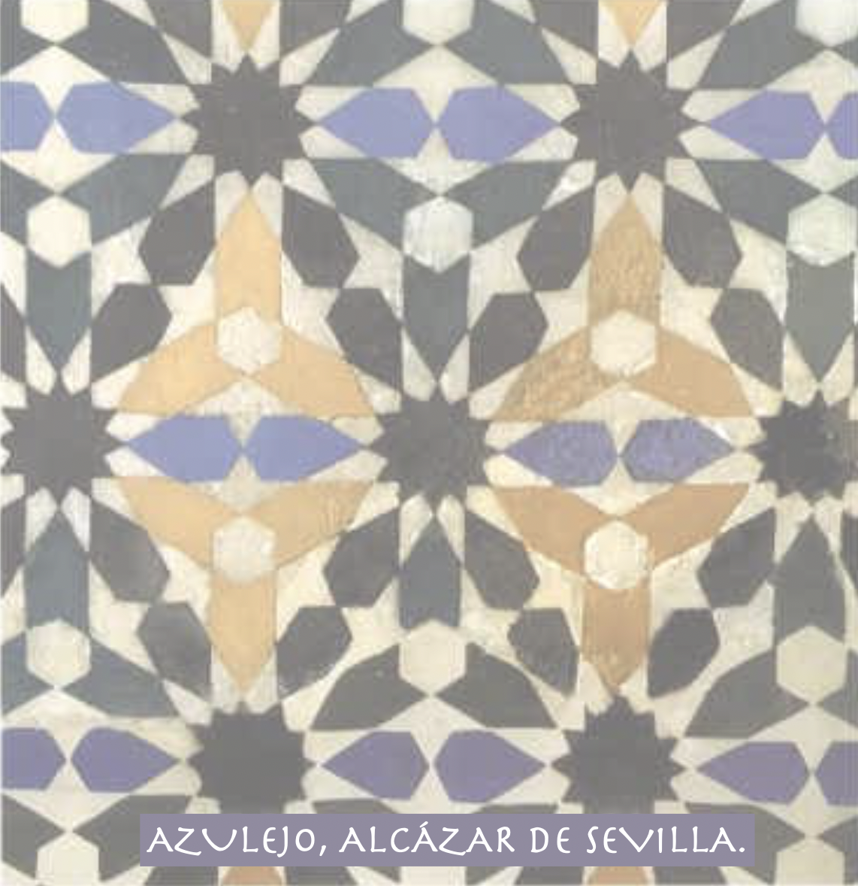

<H1> Combinatoria Algebraica en Sevilla </H1>

<H2> Miembros:</H2>

- [Emmanuel Briand](http://emmanuel.jean.briand.free.fr/)

- [Mercedes Rosas](https://mhrosas.github.io/)

<H2> Experimental mathematics:</H2>

- Emmanuel Briand mantains a Database of Piecewise Quasipolynomial Functions (https://doi.org/10.5281/zenodo.15375088).
  
> A quasipolynomial is a function on integer points given by several polynomials: one for each coset of some
> full-rank sublattice. The piecewise quasipolynomial functions considered here have as  domains of quasipolynomiality 
> the maximal cells of a fan subdividing a cone, and are zero outside this cone. 
> This database provides a full description of some small multiplicity functions from representation theory that are
> piecewise quasipolynomial in this sense. This includes or will include families of  Littlewood-Richardson
> coefficients, Kronecker coefficients, Plethysm coefficients and alike.

- Adrian Lillo has written some source code for the record-presrving  bijection and the various statistics appearing in
- our work on record codes and parking functions. (https://github.com/adrianlillo/weary_drivers)

<H2> Estudiantes y visitantes:</H2>

-  [Adrian Lillo](https://www.linkedin.com/in/adri%C3%A1n-lillo-pinto-1b1359180/) and [Stefan Trandafir](https://www.researchgate.net/profile/Stefan-Trandafir).
> Building on our decomposition of a Cayley tree via records,
> closely related to the blob encoding of Kreweras, Moszkowski,
> and Picciotto, we define parking functions anew and construct
>  a record-preserving bijection with Cayley trees. This leads
>  to an equidistribution of six statistics on both structures.
>

-  [Aaron Ocampo](https://www.linkedin.com/in/aar%C3%B3n-ocampo-amaya-b227ba310/?originalSubdomain=es)
  > Aaron is working towards his doctorate degree with a FPU fellowship. At the moment,
  > Aaron is studying the hook stability phenomena present for the much-studied Kronecker coefficients of
  > the symmetric and the linear general group, and its
  >  connection to FI-modules.

<H2> Antiguos Estudiantes y estudiantes visitantes:</H2>

- [Laura Colmenarejo](https://sites.google.com/view/l-colmenarejo/home)
  > Laura finished her PhD thesis titled "Stability in the combinatorics of representation theory" in 2016. 
  > Laura, a rising star in the area of Algebraic Combinatorics,  currently hold a tenure track position at North Carolina State Univesity.

  
  
- [Stefan Trandafir](https://www.researchgate.net/profile/Stefan-Trandafir)
  > Stefan was a frecuent visitor to the group during
  >  his PhD at Simon Fraser University in Vacouver. During
  > this time, he delved into some ideas regarding the
  > study of Kronecker coefficients, which partially stemmed
  > from our group's discussions.
  > Additionally, he wrote an article with us on a new
  > symmetry exhibited by the Littlewood-Richardson
  > coefficients. Stefan currently holds a
  > postdoctoral position with the quantum information group of
  >  Adan Cabello (Sevilla).
  
- [Álvaro Gutiérrez Cáceres](https://sites.google.com/view/gutierrez-caceres/)

  > Álvaro's undergraduate senior thesis yielded two
  > publications on the study of the plethysm of
  > symmetric functions. Following his time in
  >  Sevilla, Álvaro authored a Master's thesis at the
  > University of Bonn under the supervision of Catharina
  > Stroppel and Jacob Matherne. Presently, Álvaro is pursuing
  >  his Ph.D. under the guidance of Mark Wildon at
  > Bristol University.

- [Luis Esquivias](https://www.linkedin.com/in/luis-esquivias-quintero-60214a264/) and [Adrian Lillo](https://www.linkedin.com/in/adri%C3%A1n-lillo-pinto-1b1359180/).
  > In collaboration with Álvaro and the senior members of the group,
  > Luis and Álvaro, both undergraduate students at the time,
  > discovered a combinatorial proof of the Graham and Pollak formula
  > for the determinant of the distance matrix of a tree, utilizing
  >  the Gessel-Viennot involution.

<H2> Conferences and Workshops:</H2>

- [Algebraic Combinatorics in Sevilla](https://personal.us.es/mrosas/combinatoria_algebraica_en_Sevilla/)
   > Virtual Seminaire

- [91 Séminaire Lotharingien de Combinatoire](https://gestioneventos.us.es/slc91-seminaire-lotharingien-de-combinatoire-91)
   > Salobreña, March 17 - 20, 2024.\
   > Invited Speakers: Petter Brändén and Ira Gessel.
  
- [School and Workshop "Mathematical fundations of quantum information"](https://congreso.us.es/enredo2009/Welcome.html)
   >Sevilla, Spain, 23-27 november 2009. 

- [Diagonally symmetric polynomials and applications](https://congreso.us.es/dsym/)
   >Castro-Urdiales, October 15 - 19, 2007

 <H2> Funding:</H2>

We are funded by the following research projects::

 - CoMADmRT: Computational Methods in Algebra, D-modules and Representation Theory (PID2020-117843GB-I00)
 
 - FQM-333: Computational Algebra in NonCommutative Rings and Applications
