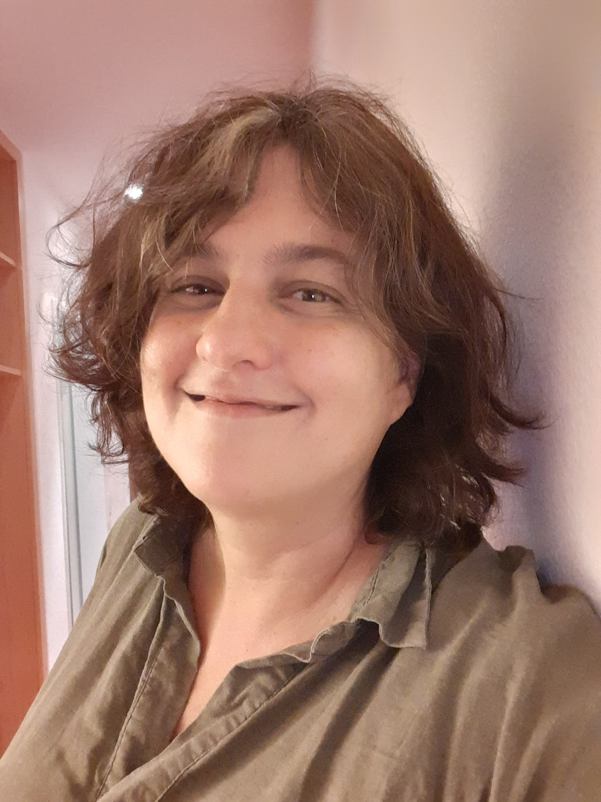

# Mercedes Rosas  
 

 

  > Buenos días/hello/Bonjour.
  > I am a professor of mathematics in the Algebra department
  > of the    Universidad de Sevilla. I am part of the group of  
  > [Algebraic Combinatorics at Sevilla](./CAenSevilla.md).
  > 
  > I wrote my PhD under the supervision of
  >  [Ira Gessel](https://people.brandeis.edu/~gessel/).
  > 
  > I have also
  > I held postdoctoral and visitor positions at the Universidad
  > Simón Bolívar, the
  >  Laboratoire d’Algèbre, de Combinatoire et
  > d’Informatique Mathématique
  > [LACIM](https://lacim.uqam.ca/en/home/) of the Université du
  >  Québec à Montréal (UQAM) and the Combinatorics group of
  > York University/Fields Institute.
  > Almost two decades ago, I came to Sevilla with a Ramón
  > and Cajal fellowship. 
  >
  >  
  > To learn about my work you can brose my
  > [Publications](./publications.md). On a few occasions, I have
  > written some work for (very)
  > [young mathematicians](./divulgacion.md), including children.
  > 
  > Estoy particularmente contenta con 
  > [El Alfil Matemático](https://personal.us.es/mrosas/      elalfilmatematico/index.html) una colección de problemas de matemáticas
  > una colección de retos matemáticos para niños y jóvenes que escribí
  > durante el confinamiento de 2020.
  >
  > La información sobre mi docencia se encuentra en la enseñanza
  > virtual de la Universidad de Sevilla 

 
