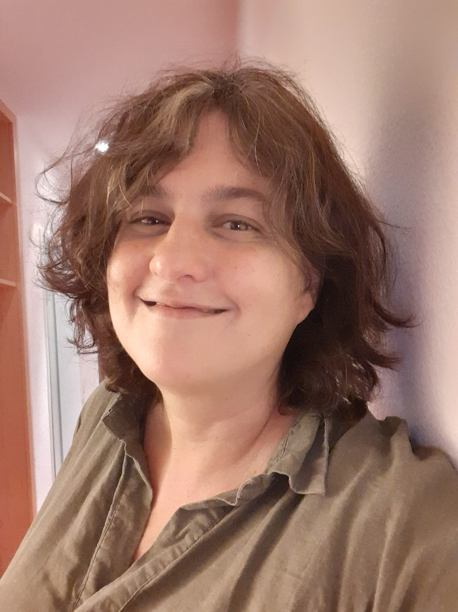

> ----------------------
> 
> 
> Buenos días, welcome to my webpage.
>
> 
> I am Mercedes Rosas, professor of mathematics in the
> [Algebra](http://www.algebra.us.es/)
>  department of the [Universidad de Sevilla](https://www.us.es/).
>  I am also part of the group of
>  [Algebraic Combinatorics at Sevilla](./CAenSevilla.md).
> 
> I wrote my PhD under the supervision of
>  [Ira Gessel](https://people.brandeis.edu/~gessel/). 
> Afterwards, I held postdoctoral and visitor positions at the
> Universidad Simón Bolívar, the Laboratoire d’Algèbre, de
> Combinatoire et d’Informatique Mathématique
> [LACIM](https://lacim.uqam.ca/fr/) of the Université du
>  Québec à Montréal (UQAM) and the Toronto Combinatorics group at
> [York University](https://www.yorku.ca/science/mathstats/) and the
> [Fields Institute](http://www.fields.utoronto.ca/).
> About two decades ago, I came to Sevilla with a Ramón
> and Cajal fellowship. 
>
> 
> 
>If you're interested in
>  delving deeper into my research, feel free to explore my
> [Publications](./publications.md).   My main interests are
> combinatorial representation theory, combinatorial Hopf algebras,
> and the theory of symmetric functions. 
>
>
>
>
> A big part of doing mathematics is learning from your
>  [collaborators](./coautores.md). I have had the
>  pleasure of writing with
> a dream-team of mathematicians 
> 
>
> ----------------------
>
> En algunas ocasiones, he escrito algunos artículos de
> [divulgación](./divulgacion.md)
>  en español pensando en los jóvenes (y muy jóvenes)
> matemáticos hispano-parlantes.
>
>  
> Estoy particularmente contenta con el
> [Alfil Matemático](https://personal.us.es/mrosas/elalfilmatematico/index.html)
> una colección de desafíos matemáticos que desarrollé 
> durante el confinamiento de 2020, así como con un
> trabajo sobre los
>  [números de Catalan](https://www.emis.de/journals/BAMV/conten/vol10/catalan.pdf)
> que preparé para
> los estudiantes del equipo olímpico venezolano.
> Por otra parte, es
>  un verdadero honor haber sido parte del primer equipo de
>  profesores de Encuentro Colombiano de Combinatoria, en 2003,
>  [ECCO](https://fardila.com/SFSUColombia/ecco.html).
> Varios de estos proyectos son el resultado directo de
> esta enriquecedora experiencia.
> 
> La información sobre mi [docencia](https://ev.us.es/) se encuentra en la enseñanza
> virtual de la Universidad de Sevilla. Este cuatrimestre estoy dictando las asignaturas de 
> [Álgebra, combinatoria y Computación](https://www.us.es/estudiar/que-estudiar/oferta-de-grados/grado-en-matematicas/1710030)
> para estudiantes del cuarto año del grado de matemáticas (y sus dobles grados), y el curso de
> [Grupos y álgebras de Lie](https://www.us.es/estudiar/que-estudiar/oferta-de-masteres/master-universitario-en-matematicas/51620018)
> para estudiantes del Master de Matemáticas. 
>
> 
> ---------------------- 

 
